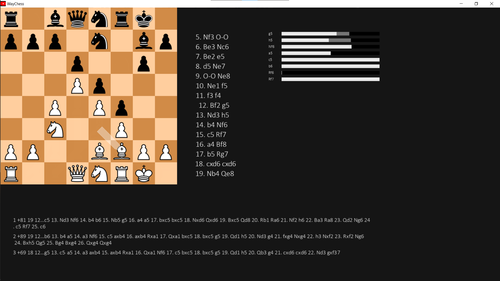

# WayChess



## Installation

There should be a Windows installer available, if you don't use Windows, install from scratch.

### Binary From Scratch

```
git clone https://github.com/r2dev2bb8/WayChess.git
cd WayChess
make
```

## Usage

Keybindings:

|    Key     |     Function     |
| ---------- | ---------------- |
| ``<-``     | Move back        |
| ``->``     | Move forward     |
| ``f``      | Flip board       |
| ``s``      | Save database    |
| ``ctrl+n`` | Create game      |
| ``n``      | Next game        |
| ``b``      | Previous game    |
| ``e``      | Toggle engine    |
| ``o``      | Load a pgn       |
| ``x``      | Toggle explorer  |
| ``q``      | Quit application |


## Tests
```
make test
```


## Goals

  - [x] Open source chess gui
  - [ ] Fully-featured
      - [x] Comments
      - [ ] Variations
      - [ ] Annotations
      - [ ] Engine matches
  - [ ] Easy to install
  - [ ] Fluid design
  - [x] Cross-platform
  - [ ] Ease of use
  - [x] Modularity
  - [x] Database

## Progress

Navigation is controlled by keybindings instead of button right now. Comments, variations, and annotations have yet to be added. The chess.com database explorer (doesn't need to login) and the engine have been somewhat stably implemented.

